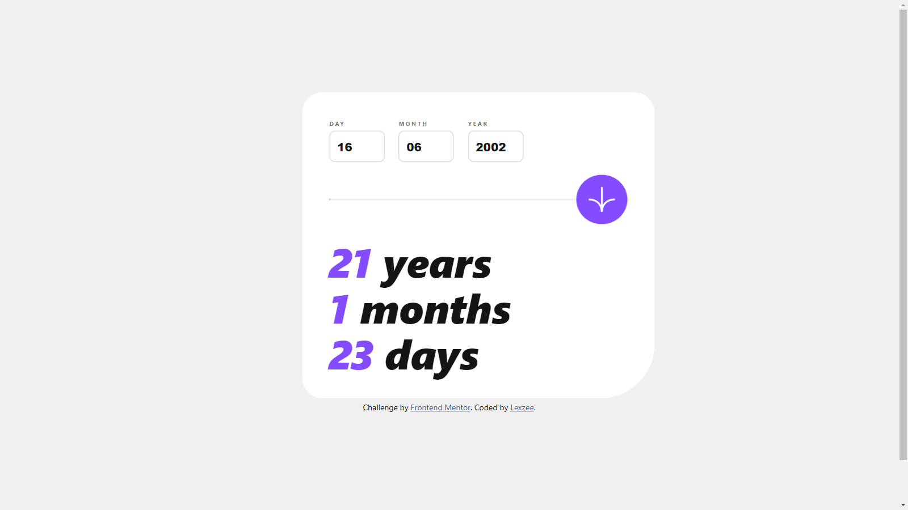

# Frontend Mentor - Age calculator app solution

This is a solution to the [Age calculator app challenge on Frontend Mentor](https://www.frontendmentor.io/challenges/age-calculator-app-dF9DFFpj-Q). Frontend Mentor challenges help you improve your coding skills by building realistic projects.

## Table of contents

- [Overview](#overview)
  - [The challenge](#the-challenge)
  - [Screenshot](#screenshot)
  - [Links](#links)
- [My process](#my-process)
  - [Built with](#built-with)
  - [What I learned](#what-i-learned)
  - [Continued development](#continued-development)
  - [Useful resources](#useful-resources)
- [Author](#author)
- [Acknowledgments](#acknowledgments)

**Note: Delete this note and update the table of contents based on what sections you keep.**

## Overview

### The challenge

Users should be able to:

- View an age in years, months, and days after submitting a valid date through the form
- Receive validation errors if:
  - Any field is empty when the form is submitted
  - The day number is not between 1-31
  - The month number is not between 1-12
  - The year is in the future
  - The date is invalid e.g. 31/04/1991 (there are 30 days in April)
- View the optimal layout for the interface depending on their device's screen size
- See hover and focus states for all interactive elements on the page
- **Bonus**: See the age numbers animate to their final number when the form is submitted

### Screenshot




### Links

- Solution URL: [Check Solution](https://your-solution-url.com)
- Live Site URL: [Visit Live Site](https://age-calc-lexzee.vercel.app)

## My process

### Built with

- Semantic HTML5 markup
- Flexbox
- Mobile-first workflow
- [DayJs](npmjs.com/package/dayjs)
- [React](https://reactjs.org/) - JS library


### What I learned

I learnt a clean and precise way of calculating the difference between two dates

```js
const getAgeDetails = (oldDate, newDate) => {
  const years = newDate.diff(oldDate, 'year');
  const months = newDate.diff(oldDate, 'months') - years * 12;
  const days = newDate.diff(oldDate.add(years, 'year').add(months, 'month'), 'day')

  return {
    years,
    months,
    days,
    allDays: newDate.diff(oldDate, 'day'),
  };
};
```

### Continued development

Use this section to outline areas that you want to continue focusing on in future projects. These could be concepts you're still not completely comfortable with or techniques you found useful that you want to refine and perfect.


### Useful resources

- [Calculate the date](https://stackoverflow/a/64695744) - This helped me for calculation of the Dates. I really liked this pattern and will use it going forward.

## Author

- Website - [Abdulquddus Abdulrahman (Lexzee)](https://www.github.com/lexzee)
- Frontend Mentor - [@lexzee](https://www.frontendmentor.io/profile/lexzee)
- Twitter - [@devlexzee](https://www.twitter.com/devlexzee)


## Acknowledgments

Big thanks to [Patryk Janik](https://stackoverflow.com/users/8786111/patryk-janik), his solution on [stackoverflow](https://stackoverflow/a/64695744) helped me for calculation of the Dates.
